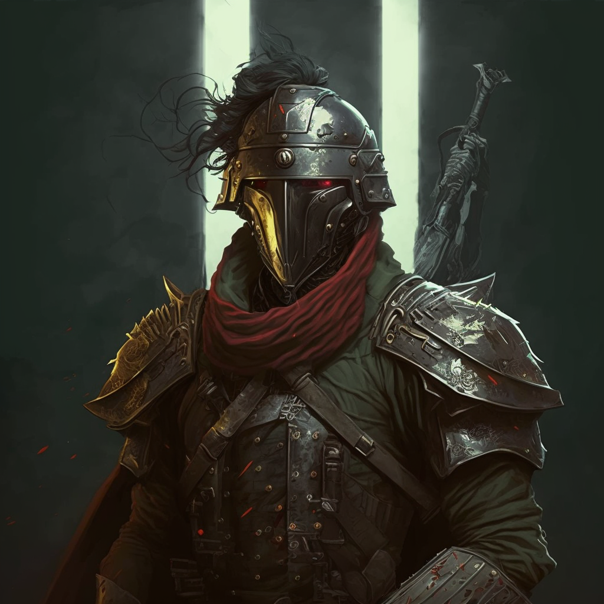

# KurkThe2DGame

  
  
  

## Description
"Kurk" est un jeu vidéo narratif et immersif qui transporte les joueurs au cœur d'une ville néo-gothique mystérieuse, s'inspirant des univers sombres et mythiques de "Magic the Gathering" (Innistrad) et de "Bloodborne" (Yharnam). L'intrigue captivante explore la chute et la descente à la folie d'une société, suivant les péripéties de personnages clés, tels que des vampires, des anges, des goules, des abominations et des membres de cultes divers.

L'atmosphère du jeu évolue, passant de l'espoir au début de l'aventure vers le chaos et le désespoir, offrant une expérience riche et émotionnelle.

## Fonctionnalités Principales (MVP)

- **Survival Game :** Le jeu se concentre initialement sur un mode survie.

- **Système de Vague Infini :** Intégration d'un système de vagues infinies d'ennemis.

- **Shop pour Débloquer d'Autres Armes et Pouvoirs :** Mise en place d'une boutique permettant de débloquer une variété d'armes et de pouvoirs.

- **One Tap pour se Battre :** Utilisation d'un système simple de "One Tap" pour les combats.

- **Boss, Mini-Boss et Ennemis Mineurs :** Présence de boss, de mini-boss et d'ennemis mineurs.

## Fonctionnalités Principales (Final Version)

- **Évolution vers un Mode Plateforme 2D, Souls-like et RPG :** Passage à un esprit de plateforme 2D, souls-like et RPG.

- **Personnalisation du Personnage Principal :** Possibilité pour les joueurs de personnaliser leur personnage principal.

- **Expansion des Lieux :** Accès à davantage d'endroits dans le monde du jeu.

- **Mode Histoire avec Fins Multiples :** Introduction d'un mode histoire avec des fins multiples.

- **Ajout de Compétences, Pouvoirs et Capacités :** Enrichissement du personnage avec de nouvelles compétences, pouvoirs et capacités.

# Technologies
[![Kotlin][Kotlin]][Kotlin-url]
[![IOS][IOS]][IOS-url]
[![Android][Android]][Android-url]

## Langages et Frameworks
Les langages et frameworks utilisés pour le développement de KURK sont les suivants:

- KorGE Game Engine
- Kotlin
- Compose Multiplatform

## Bibliothèques et APIs
Les bibliothèques et APIs suivantes sont utilisées dans le développement de KURK :

- LDtk

## Structure du Projet

    
    
    
    

  
## Galerie

  
  
  

  
  
  

  
  
  

## Plateformes
L'application sera disponible sur les plateformes mobile iOS et Android pour la v1.0.

## Date de sortie
La date de sortie de l'application sur IOS et Android est prévue pour ???.

## Plus de détails
Projet fait par des passionnées de la tech Kotlin et de KorGE.

## Comment contribuer
Le projet est ouvert aux contributions. N'hésitez pas à soumettre vos idées et suggestions en créant une nouvelle "issue" dans le repository et/ou me faire part de ceci via Github et autres.

  

[Kotlin]: https://img.shields.io/badge/Kotlin-563D7C?style=for-the-badge&logo=kotlin&logoColor=7F52FF
[Kotlin-url]: https://kotlinlang.org/
[IOS]: https://img.shields.io/badge/IOS-white?style=for-the-badge&logo=apple&logoColor=silver
[IOS-url]: https://developer.apple.com/xcode/swiftui/
[Android]: https://img.shields.io/badge/Android-lightgreen?style=for-the-badge&logo=android
[Android-url]: https://www.android.com/intl/en_ca/
