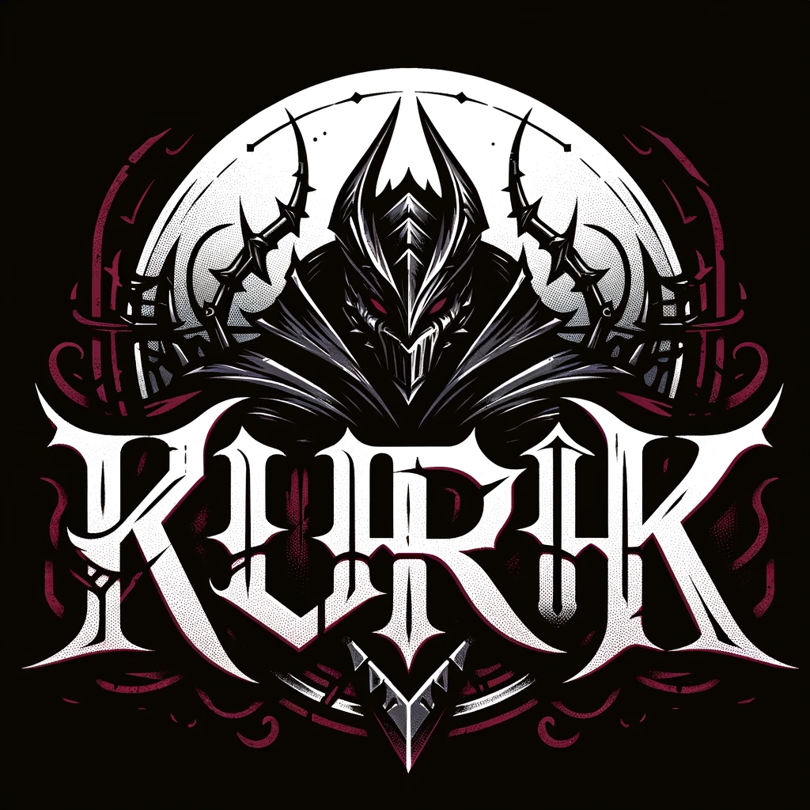

# KurkThe2DGame

  
  
  

## Description
"Kurk" is a narrative and immersive video game that transports players into the heart of a mysterious neo-gothic city, inspired by the dark and mythical worlds of "Magic the Gathering" (Innistrad) and "Bloodborne" (Yharnam). The captivating storyline explores the fall and descent into madness of a society, following the adventures of key characters, such as vampires, angels, ghouls, abominations, and members of various cults.

The game's atmosphere evolves from hope at the beginning of the adventure to chaos and despair, offering a rich and emotional experience.

## Main Features (MVP)

- **Survival Game:** The game initially focuses on a survival mode.

- **Infinite Wave System:** Integration of an infinite wave system of enemies.

- **Shop to Unlock Other Weapons and Powers:** Implementation of a shop to unlock a variety of weapons and powers.

- **One Tap to Fight:** Use of a simple "One Tap" system for combat.

- **Bosses, Mini-Bosses, and Minor Enemies:** Presence of bosses, mini-bosses, and minor enemies.

## Main Features (Final Version)

- **Evolution to a 2D Platformer, Souls-like, and RPG Mode:** Transition to a 2D platformer, souls-like, and RPG spirit.

- **Customization of the Main Character:** Ability for players to customize their main character.

- **Expansion of Locations:** Access to more locations in the game world.

- **Story Mode with Multiple Endings:** Introduction of a story mode with multiple endings.

- **Addition of Skills, Powers, and Abilities:** Enrichment of the character with new skills, powers, and abilities.

# Technologies
[![Kotlin][Kotlin]][Kotlin-url]
[![IOS][IOS]][IOS-url]
[![Android][Android]][Android-url]

## Languages and Frameworks
The languages and frameworks used for the development of KURK are as follows:

- KorGE Game Engine
- Kotlin
- Compose Multiplatform

## Libraries and APIs
The following libraries and APIs are used in the development of KURK:

- LDtk

## Project Structure

    
    
    
    

  
## Gallery

  
  
  

  
  
  

  
  
  

## Platforms
The application will be available on iOS and Android mobile platforms for v1.0.

## Release Date
The release date of the application on iOS and Android is scheduled for ???.

## More Details
Project created by tech enthusiasts in Kotlin and KorGE.

## How to Contribute
The project is open to contributions. Feel free to submit your ideas and suggestions by creating a new "issue" in the repository and/or contacting me via GitHub and other channels.

  

[Kotlin]: https://img.shields.io/badge/Kotlin-563D7C?style=for-the-badge&logo=kotlin&logoColor=7F52FF
[Kotlin-url]: https://kotlinlang.org/
[IOS]: https://img.shields.io/badge/IOS-white?style=for-the-badge&logo=apple&logoColor=silver
[IOS-url]: https://developer.apple.com/xcode/swiftui/
[Android]: https://img.shields.io/badge/Android-lightgreen?style=for-the-badge&logo=android
[Android-url]: https://www.android.com/intl/en_ca/
